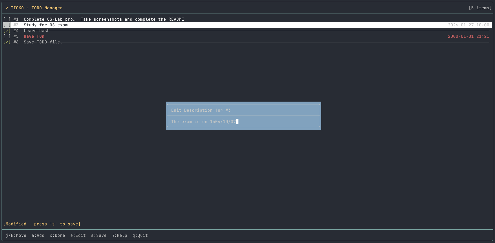
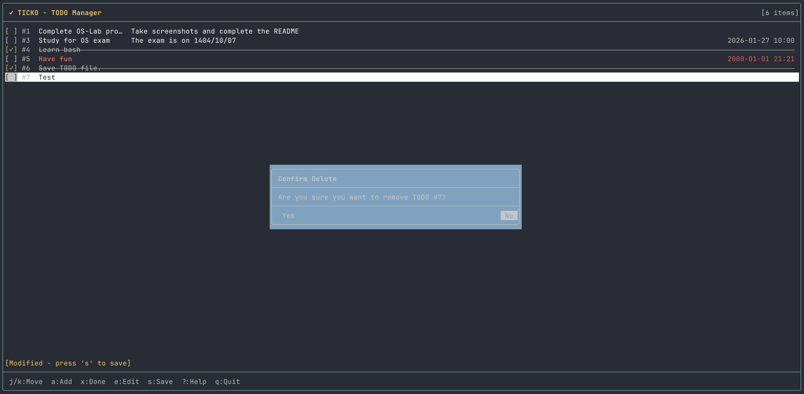
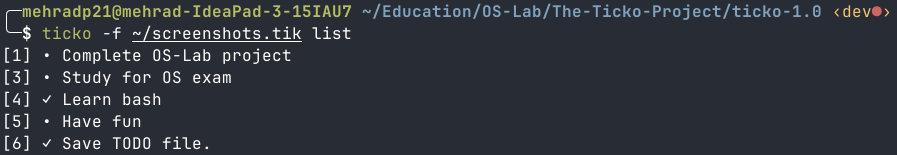

Ticko - A TUI TODO List App
===========================

Ticko is a terminal-based TODO and task management tool written in **Bash**. It provides
both an interactive **Terminal User Interface (TUI)** and a
**Command-Line Interface (CLI)**, allowing users to manage tasks efficiently from the
terminal or automate workflows using scripts.

Team Members
------------

- Mehrad Pooryoussof
- Abolfazl Tavakolian
- MohammadHossein MaarefVand
- AmirHossein Nasrollahi

Features
--------

- Add, edit, remove, and mark TODO items as completed or pending
- TUI mode for interactive management
- CLI mode for scripting and automation
- Customizable configuration and data file locations
- Search and navigation within TUI
- Cross-platform and lightweight

Installation
------------

1. Download the latest `.deb` package from the GitHub releases page:

   ```bash
   https://github.com/CESA-UT/os-lab-1404-Ticko-TUI/releases
   ```

2. Install the package using `dpkg`:

   ```bash
   sudo dpkg -i ticko_1.0_all.deb
   ```

3. Once installed, you can run Ticko from the terminal:

   ```bash
   ticko
   ```

Usage
-----

### TUI Mode

Run `ticko` without arguments to start the interactive TUI:

```bash
ticko
```

#### TUI Key Bindings

##### Navigation

- `j` / Down: Move down
- `k` / Up: Move up
- `g` / Home: Go to first item
- `G` / End: Go to last item
- PageUp / PageDown: Scroll by one page
- `H` / `L`: Go to first/last visible item

##### Actions

- `a` / `o`: Add a new TODO
- `x` / Space: Toggle completion
- `D`: Delete selected TODO
- `e`: Edit description
- `d`: Set/edit due date
- `t`: Edit title
- Enter: Show details

##### Search

- `/`: Start search
- `n`: Next search result
- `N`: Previous search result

##### General

- `s`: Save changes
- `r`: Refresh
- Enter: Confirm action
- Escape: Cancel/close
- `?`: Show help
- `q`: Quit

### CLI Mode

Run `ticko` with commands and arguments:

```bash
ticko list                   # List all TODO items
ticko list --completed       # List completed items
ticko list --pending         # List pending items

ticko add "Title"            # Add new TODO
ticko add "Title" -d "Desc"  # Add with description
ticko add "Title" -t "YYYY-MM-DD HH:MM"  # Add with due date

ticko done ID                # Mark TODO as done
ticko undone ID              # Mark TODO as not done
ticko remove ID              # Remove TODO

ticko edit ID                # Edit TODO
ticko edit ID -d "Desc"      # Edit description
ticko edit ID -t "YYYY-MM-DD HH:MM"  # Edit due date
```

Configuration
-------------

Ticko supports system-wide and user-specific configuration files:

- System-wide: `/etc/ticko.conf`
- User-specific: `~/.config/ticko/ticko.conf`

The environment variable `XDG_CONFIG_HOME` can override the default config directory.

Screenshots
-----------

**TUI Interface**


**Editing Description**


**Confirming Delete**


**Searching in TUI**


**Listing in CLI**


License
-------

Ticko is released under the **MIT License**.

```license
Permission is hereby granted, free of charge, to any person obtaining a copy
of this software and associated documentation files (the "Software"), to deal
in the Software without restriction, including the rights to use, copy, modify,
merge, publish, distribute, sublicense, and/or sell copies of the Software, and
to permit persons to whom the Software is furnished to do so, subject to the
following conditions:

The above copyright notice and this permission notice shall be included in all
copies or substantial portions of the Software.

THE SOFTWARE IS PROVIDED "AS IS", WITHOUT WARRANTY OF ANY KIND, EXPRESS OR
IMPLIED, INCLUDING BUT NOT LIMITED TO THE WARRANTIES OF MERCHANTABILITY,
FITNESS FOR A PARTICULAR PURPOSE AND NONINFRINGEMENT. IN NO EVENT SHALL THE
AUTHORS OR COPYRIGHT HOLDERS BE LIABLE FOR ANY CLAIM, DAMAGES OR OTHER
LIABILITY, WHETHER IN AN ACTION OF CONTRACT, TORT OR OTHERWISE, ARISING FROM,
OUT OF OR IN CONNECTION WITH THE SOFTWARE OR THE USE OR OTHER DEALINGS IN THE
SOFTWARE.
```

References
----------

- Bash: [https://www.gnu.org/software/bash/](https://www.gnu.org/software/bash/)
- Ticko source: [GitHub Repository](https://github.com/CESA-UT/os-lab-1404-Ticko-TUI)
